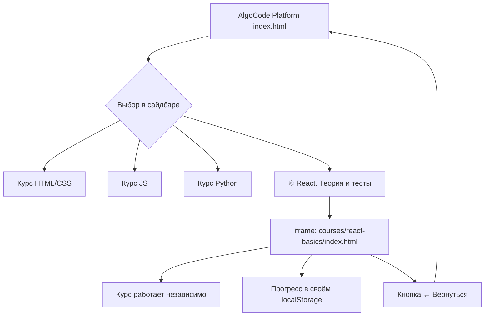

# План интеграции курса React. Теория и тесты

## Цель

Добавить курс `courses/react-basics` (standalone SPA) на платформу AlgoCode в виде ссылки/пункта навигации. Курс остаётся самостоятельным приложением, но доступен из основного интерфейса платформы.

---

## 🏗 Текущая архитектура

```
До интеграции:
┌─────────────────────────────────────┐
│        AlgoCode Platform            │
│  ┌──────────┐  ┌──────────────────┐ │
│  │ Sidebar  │  │ Editor + Preview │ │
│  │ ──────── │  │ (HTML/CSS/JS/Py) │ │
│  │ Курсы    │  └──────────────────┘ │
│  │ Задания  │                       │
│  └──────────┘                       │
└─────────────────────────────────────┘

┌─────────────────────────────────────┐
│  React. Теория и тесты (standalone) │
│  ┌──────────┐  ┌──────────────────┐ │
│  │ Sidebar  │  │ Theory + Tasks   │ │
│  │ (темы)   │  │ (60 заданий)     │ │
│  └──────────┘  └──────────────────┘ │
│  localStorage: "react_course_progress_v2" │
└─────────────────────────────────────┘
```

```
После интеграции:
┌─────────────────────────────────────┐
│        AlgoCode Platform            │
│  ┌──────────┐  ┌──────────────────┐ │
│  │ Sidebar  │  │ Editor + Preview │ │
│  │ ──────── │  │ OR               │ │
│  │ Курсы    │  │ React Course     │ │
│  │ Задания  │  │ (в iframe)       │ │
│  │ ──────── │  └──────────────────┘ │
│  │ 🆕 React │                       │
│  │   Теория │                       │
│  └──────────┘                       │
│  Два независимых localStorage       │
│  - AlgoCode: "educode_*"            │
│  - React:   "react_course_progress_v2" │
└─────────────────────────────────────┘
```

---

## 🎯 Подход: Добавление ссылки в сайдбар

Курс остаётся standalone-приложением. В сайдбар платформы добавляется новый пункт, который при клике загружает React-курс в основную область (вместо редактора).

---

## 📋 Детальный план работ

### Шаг 1. Модификация [`css/common.css`](css/common.css)

Добавить стили для:
- Нового блока в сайдбаре «Дополнительные курсы»
- Пункта "React. Теория и тесты" с иконкой ⚛️
- Секции `extra-courses` с отступами и разделителем

### Шаг 2. Модификация [`index.html`](index.html)

Добавить в сайдбар (после `.filter-bar` или в футер) новый элемент:

```html
<div class="extra-courses-section">
  <div class="extra-courses-header">📚 Самостоятельные курсы</div>
  <nav class="extra-course-list">
    <button class="extra-course-btn" id="openReactCourse">
      <span class="extra-course-icon">⚛️</span>
      <span class="extra-course-info">
        <span class="extra-course-title">React. Теория и тесты</span>
        <span class="extra-course-desc">6 тем · 60 заданий</span>
      </span>
    </button>
  </nav>
</div>
```

### Шаг 3. Модификация [`js/core/platform.js`](js/core/platform.js)

Добавить метод `_openCourseInMain(coursePath)`, который:

1. Скрывает приветственный экран (`#welcomeScreen`)
2. Скрывает рабочую область (`#workspace`) 
3. Вставляет `<iframe>` в `#mainContent`, загружающий `courses/react-basics/index.html`
4. Добавляет кнопку «← Вернуться к заданиям» в хедер

**Псевдокод метода:**

```javascript
_openEmbeddedCourse(coursePath) {
  const welcome = document.getElementById('welcomeScreen');
  const workspace = document.getElementById('workspace');
  const mainContent = document.getElementById('mainContent');

  // Скрываем приветствие и рабочую область
  welcome?.classList.add('hidden');
  workspace.style.display = 'none';

  // Создаём контейнер для курса
  mainContent.innerHTML = `
    <div class="embedded-course">
      <div class="embedded-course-header">
        <button class="btn-ghost" id="closeEmbeddedCourse">
          ← Вернуться к заданиям
        </button>
        <span>⚛️ React. Теория и тесты</span>
      </div>
      <iframe 
        src="${coursePath}" 
        class="embedded-course-frame"
        sandbox="allow-scripts allow-modals allow-same-origin allow-forms"
      ></iframe>
    </div>
  `;

  // Обработчик кнопки "Назад"
  document.getElementById('closeEmbeddedCourse')
    ?.addEventListener('click', () => this._closeEmbeddedCourse());
}

_closeEmbeddedCourse() {
  const workspace = document.getElementById('workspace');
  if (workspace) workspace.style.display = '';

  // Восстанавливаем задание, если оно было открыто
  if (this.currentTask) {
    this._updateTaskHeader(this.currentTask, this.currentTask.config);
    this._renderSample();
  } else {
    // Показываем приветствие
    const welcome = document.getElementById('welcomeScreen');
    if (!this._filter) welcome?.classList.remove('hidden');
  }
}
```

### Шаг 4. Биндинг кнопки в [`js/core/platform.js`](js/core/platform.js)

В методе `bindUI()` добавить:

```javascript
document.getElementById('openReactCourse')
  ?.addEventListener('click', () => {
    this._openEmbeddedCourse('courses/react-basics/index.html');
  });
```

### Шаг 5. Стили для iframe в [`css/common.css`](css/common.css)

```css
.embedded-course {
  display: flex;
  flex-direction: column;
  height: 100%;
}

.embedded-course-header {
  display: flex;
  align-items: center;
  gap: 12px;
  padding: 12px 20px;
  background: var(--bg-overlay);
  border-bottom: 1px solid var(--border-color);
  flex-shrink: 0;
}

.embedded-course-frame {
  flex: 1;
  width: 100%;
  border: none;
  min-height: calc(100vh - 120px);
}
```

### Шаг 6. Стили для секции дополнительных курсов в [`css/common.css`](css/common.css)

```css
.extra-courses-section {
  margin-top: auto;
  border-top: 1px solid var(--border-color);
  padding: 12px;
}

.extra-courses-header {
  font-size: 0.7rem;
  text-transform: uppercase;
  letter-spacing: 0.05em;
  color: var(--text-secondary);
  margin-bottom: 8px;
  padding: 0 4px;
}

.extra-course-btn {
  display: flex;
  align-items: center;
  gap: 10px;
  width: 100%;
  padding: 10px 12px;
  border: 1px solid var(--border-color);
  border-radius: var(--radius-sm);
  background: var(--surface);
  cursor: pointer;
  transition: all 0.2s;
  text-align: left;
}

.extra-course-btn:hover {
  background: var(--surface-hover);
  border-color: var(--accent);
}

.extra-course-icon {
  font-size: 1.4rem;
  flex-shrink: 0;
}

.extra-course-info {
  display: flex;
  flex-direction: column;
  gap: 2px;
  min-width: 0;
}

.extra-course-title {
  font-weight: 600;
  font-size: 0.85rem;
  color: var(--text);
  white-space: nowrap;
  overflow: hidden;
  text-overflow: ellipsis;
}

.extra-course-desc {
  font-size: 0.7rem;
  color: var(--text-secondary);
}
```

---

## ✅ Критерии готовности

- [ ] В сайдбаре платформы появилась секция «📚 Самостоятельные курсы»
- [ ] В секции есть кнопка «⚛️ React. Теория и тесты»
- [ ] При клике на кнопку в основной области открывается iframe с react-basics курсом
- [ ] В iframe есть кнопка «← Вернуться к заданиям», возвращающая к редактору
- [ ] Прогресс курса react-basics сохраняется независимо (localStorage)
- [ ] Прогресс платформы не затрагивается
- [ ] При сворачивании сайдбара секция скрывается/показывается корректно
- [ ] Адаптивность: на мобильных устройствах iframe работает корректно

---

## 📂 Изменяемые файлы

| Файл | Что делать |
|------|-----------|
| [`index.html`](index.html) | Добавить секцию extra-courses в сайдбар |
| [`css/common.css`](css/common.css) | Добавить стили для extra-courses и embedded-course |
| [`js/core/platform.js`](js/core/platform.js) | Добавить методы `_openEmbeddedCourse`, `_closeEmbeddedCourse` и биндинг кнопки |

**Никакие файлы в `courses/react-basics/` не изменяются** — курс остаётся полностью независимым.

---

## 📊 Mermaid: Схема навигации



---

## 🛡 Риски и митигации

| Риск | Митигация |
|------|-----------|
| iframe может не загрузиться без HTTP-сервера | Платформа и так требует сервера (ES modules, fetch) |
| Конфликт стилей | iframe изолирован, стили не пересекаются |
| Два независимых прогресса | Разные ключи localStorage — не пересекаются |
| Кнопка "Назад" может потеряться при рефакторинге | Вынести в отдельный класс/метод в platform.js |
